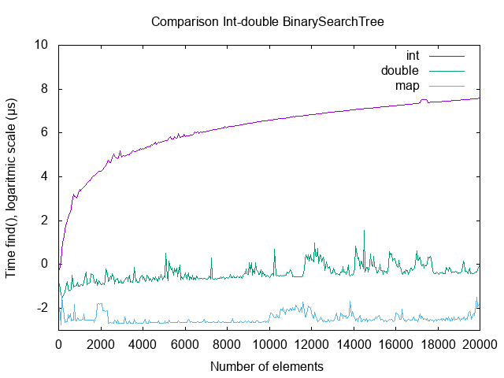
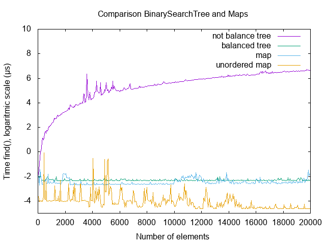
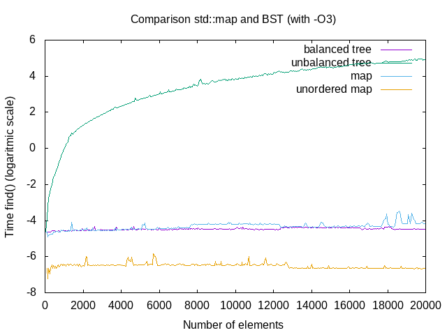

#

## Introduction

The purpose of the project was to implement a templated binary search tree, complete with iterators, in C++. In particular, we wanted to observe the behavior of the former in both a balanced and an unbalanced situation, comparing its performances with the ones of the standard library  classes `map` and `unordered_map`. The whole code was documented using Doxygen formatting.

## Structure of the classes

The BinarySearchTree class is based on a nested class called Node, which is defined as a pair of a key and a value. Those two variables are the templated ones, since we may to construct trees having different types of nodes.

**Node** is a `struct` because all its methods and variables are public for the tree to use. The struct was nested in the tree and set as private because we didn't want it to be exposed to the user. Despite it not using the comparison template, we found most suitable to keep it inside the tree from a logical point of view. The key inside Node is defined as constant because we wanted to preserve the integrity of the tree after a node has been inserted, preventing any user to modify its value and thus corrupt the inner structure of the tree, which is order with nodes having lower key values on the left, and higher values on the right. 

A node object also contains three pointers: one to its parent node and two to its children. For the children nodes we decided to employ the `unique_ptr` class defined in the standard library to facilitate memory management and improve overall consistence for tree operations.

**BinarySearchTree** only has two member variables: `root` which is a private unique pointer to its root node, and `compare` which is a functional object we added to store the value for the third template.

The last two classes we implemented for the tree are **Iterator** and **ConstIterator**, which are used in order to perform forwards iterations on the tree. They are public because users may want to iterate on the tree by using them. We needed both since some methods require a constant access to member variables to ensure their functionality. Those iterators are build from a node and are only able to iterate forward using the overloading for `operator++`. Constant iterator is a child class for the normal iterator, since they share most of their methods.

## Methods

The Node class only has constructors using a pair of values, a parent and possibly another node (copy constructor).

The iterators notably have an overloading of the `operator*` which returns the pair of key, value containd in the node to which the iterator is currently pointing to. The method `getNode` was added in order to retrive the Node pointed by the iterator and is defined as private in order not to expose the Node class.

For the BinarySearchTree, its most relevant methods are:

* `findNearest`, which returns an iterator to an element with the chosen key, if the element is present. Otherwise, the methods return an iterator to the node which would be the parent of the former if it was present. This method is used both in `find` and `insert` public methods, for different purposes.

* Copy and move semantic, implemented as constructors and overloadings of `operator=`. This allows us to perform deep copies of a tree or moving its elements into another tree structure. It make use of the `copy` recursive method to perform the insertion.

* `balance`, which originally was based on the Day-Stout-Warren algorithm to perform in-place balancing with O(n) complexity for operations and O(1) complexity for memory, has been changed in a more simple yet still effective method making use of a `vector` container and performing recursive insertion of elements through bisection. We judged this new method more fitting for the cause since it makes use of our iterators and is more intuitive in its use of unique pointers.

* `printOrderedList` and `printTree`, which allows the user to visualize the tree structure respectively in a sequential and in a graphic way. They are used for the overloading of `operator<<` and the default between them can be specified as argument on compile time.

* `begin` and `end`, which are the methods used to provide stopping conditions to the forward iteration inside the tree.

* `compare`, which is a functional object used to perform templated comparisons between node keys. It is used to allow custom rearrangements of the tree order by the user.

* `operator[]`, which is used both to access and change the value of a specific node based on its key value.

## Tests

We created a file `BinarySearchTreeTest.cpp` in which we compared different constructors, using different types for the templates, and in general all the functions defined in the methods section.

## Benchmarks

We performed various performance tests on our BinarySearchTree class find method.

First of all, we defined two unbalanced trees having `int` and `double` as key values. We compared their behaviour with the one of an int `map` object by increasing gradually the number of elements. The result is presented in the following plot:

It is evident how a BinarySearchTree with double nodes have a behaviour which is consistent with the one of map, while the int one is much slower. We think that behavior could be explained by the rapidity in which the two values are compared, since a bitwise comparison can be performed much faster on double values rather than integers.

After that, we choose to compare ordered and unordered instances of our class and of `map`, which has an unordered equivalent named `unordered_map`, all having integer nodes. We performed two comparisons, in which we used both -O0 and -O3 optimization. The results obtained are presented in the graphs below:

In both cases we can see how our unordered BinarySearchTree has the worst performances, while the unordered map object achieves the best overall time. This is due to the fact that the find method in the unordered map makes the access to elements faster, despite it being unordered. In both cases our balanced tree achieved performances that are very similar to those of `map`, sometimes being even faster than the latter. This could be explained by our simpler implementation of the class, which may enable the compiler to perform more aggressive optimizations, speeding up the research. Overall, we can be satisfied with our implementation.